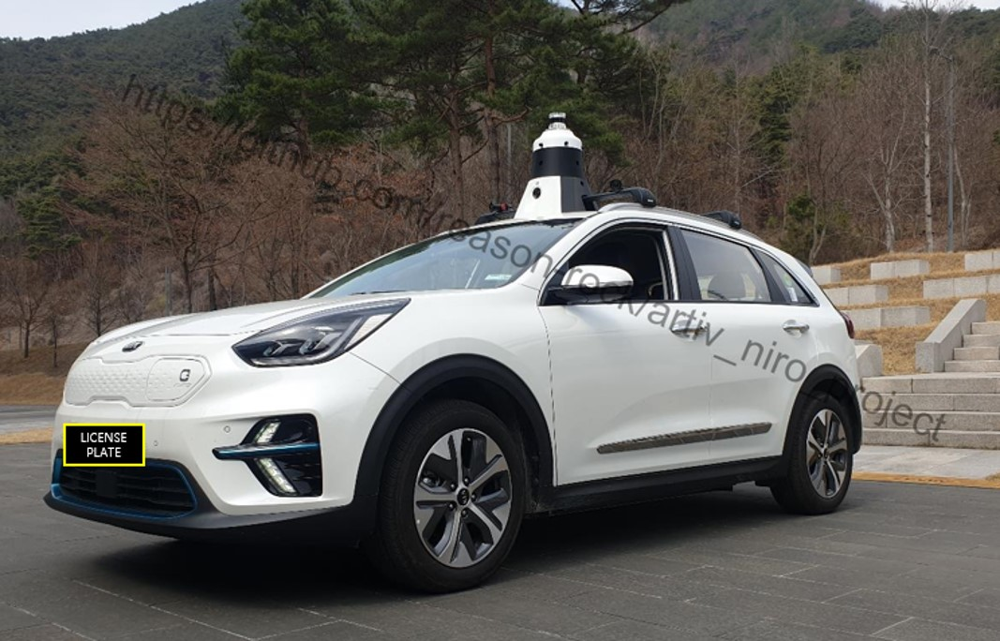
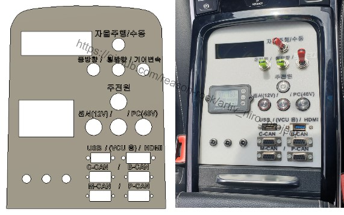
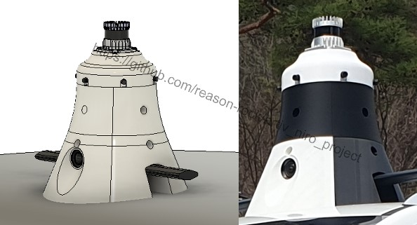
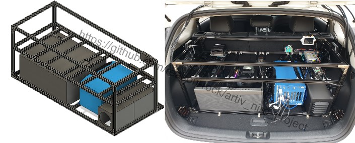

# ARTIV_Niro_Project

### 2nd Generation of ARTIV Autonomous Vehicle

All hardware design/modification for autonomous driving (Sensor mounting, Electronics, Control pannel etc..) by [reason_rock](https://github.com/reason-rock)(2022~2024) (Solo development)
> For safety and reliable results, the Longitudinal/Lateral(acceleration/deceleration and steering)controller is assisted by a professional company

# Spec
 ### Rear Equipment Rack:
-   **Total Power Output:** 3kW
-   **Various Voltage Outputs:** AC/DC (220V, 12V, 24V, 48V)
-   **PC Installation:** Supports easy installation various PC types (IPC, ATX, Jetson, etc.)
-   **Sensor/Device Installation:** Supports easy installation of sensors/devices such as GPS/IMU, LIDAR/CAMERA Controllers.
-   **Cooling:** Active cooling system with vent-covered fans for all weather condition in Daegu.
		
### Integrated Sensor Mast Module:

-   **360° FOV Multi-Camera:** Provides a complete field of view.
-   **360° FOV LIDAR:** Offers a omnidirectional LIDAR scanning range.
-   **Wide-angle External Camera(x3):** Ensures an additional data.
-   **Easy-Installation:** Thanks to the integrated mast module, installation and removal are designed to be effortless, allowing for easy integration of sensors and devices

### Control Pannel:

-   **Power control:** Individual power sources can be controlled via switches.
-   **Power monitor:** Real-time monitoring of power usage is available.
-   **CAN port:** Accessible to all CAN lines in the vehicle.
-   **USB/HDMI Port:** Convenient access to PC-related peripherals in the rear rack.
-   **Full-touchscreen monitor:** Intuitive control via touch is possible (subject to ubuntu UI limitations).

## CAD Design vs Real
#### Control Pannel

#### Integrated Sensor Mast Moule

#### Rear Equipment Rack
